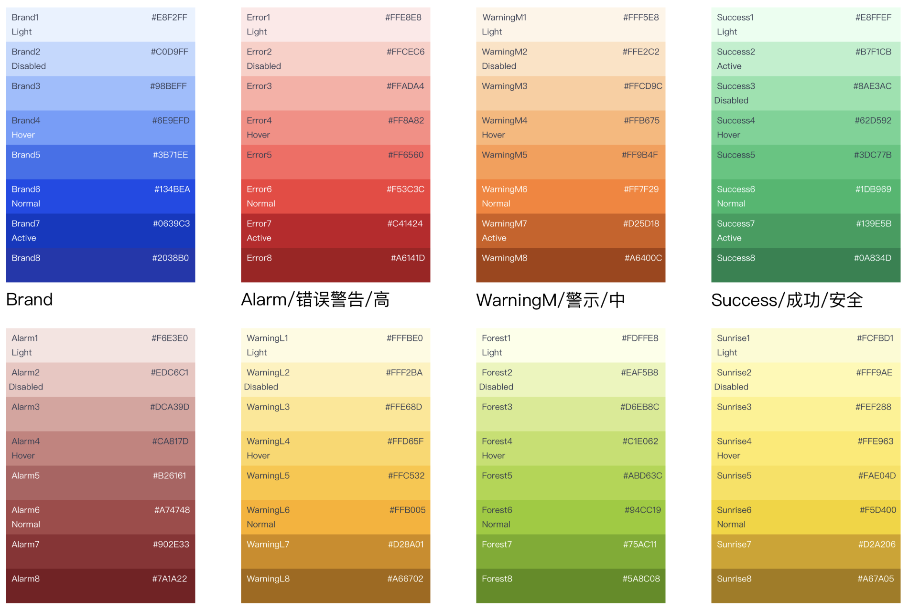
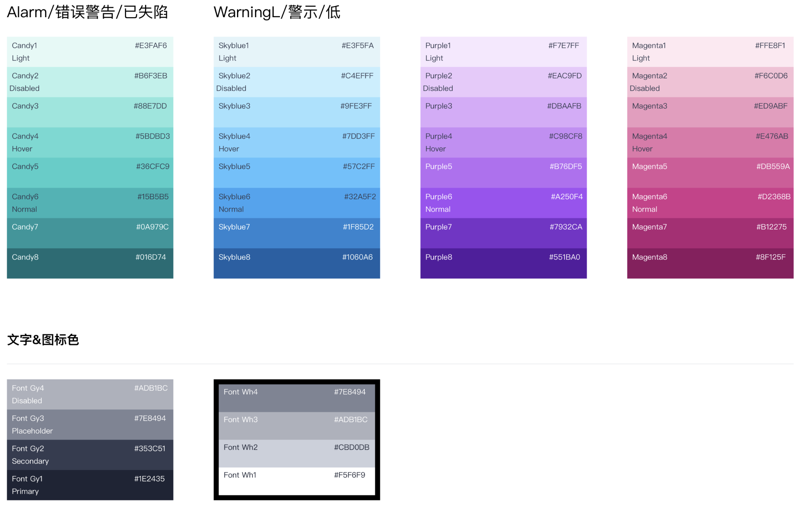

<p align="center">

</p>
<h1 align="center">unocss-preset-ued</h1>
<h3 align="center">AnHeng Preset for UnoCSS</h3>

[](https://npmjs.com/package/unocss-preset-scalpel)
[](https://nodejs.org/en/about/releases/)
[](https://github.com/macheteHot/unocss-preset-scalpel/actions/workflows/ci.yml)

>

## Installation

```sh
npm i preset-ued unocss --save-dev # with npm
yarn add preset-ued unocss -D # with yarn
pnpm add preset-ued unocss -D # with pnpm
```

## Usage

```js
import { defineConfig } from 'unocss'
import { presetUed } from 'unocss-preset-scalpel'

export default defineConfig({
  presets: [
    presetUed({
      // config
    }),
  ],
})
```

## shortcuts

#### native css is sooooo long this preset define some shortcuts

| shortcut |      mean      | desc |
| :------: | :------------: | :--- |
|    m     |     margin     |      |
|    p     |    padding     |      |
|    w     |     width      |      |
|    h     |     height     |      |
|    t     |      top       |      |
|    r     |     right      |      |
|    b     |     bottom     |      |
|    l     |      left      |      |
|    x     | left and right |      |
|    y     | top and bottom |      |

## How to use

  
- ### color and background

  
  
  > support shortcut <code>color-\<type>-\<num></code>
  > support shortcut <code>bg-background-\<type>-\<num></code>

  > types

  |    type     |     mean     | desc |
  | :---------: | :----------: | :--- |
  |   inherit   |   inherit    |      |
  |   current   | currentColor |      |
  | transparent | transparent  |      |
  |    black    |     #000     |      |
  |    white    |     #fff     |      |
  |    brand    |    values    |      |
  |    error    |    values    |      |
  |  warningM   |    values    |      |
  |  warningL   |    values    |      |
  |   success   |    values    |      |
  |    alarm    |    values    |      |
  |    gray     |    values    |      |

  > values

  |   values    |             |          |
  | :---------: | :---------: | :------- |
  |   \<1-8>    |             |          |
  |    light    |    hover    | disabled |
  | transparent | transparent |          |
  |   normal    |   active    |          |

  > token

  |               token                | mean  | desc |
  | :--------------------------------: | :---: | :--- |
  |           color-bg-page            | gray1 |      |
  |         color-bg-container         | white |      |
  |    color-bg-secondarycontainer     | gray1 |      |
  |         color-bg-component         | white |      |
  |    whcolor-component-borderite     | gray3 |      |
  |       color-component-border       | gray4 |      |
  | color-bg-secondarycontainer-hover  | gray2 |      |
  | color-bg-secondarycontainer-active | gray4 |      |
  |      color-bg-component-hover      | gray1 |      |
  |     color-bg-component-actice      | gray3 |      |
  |    color-bg-component-disabled     | gray2 |      |

- ### vertical-align

  > support shortcut <code>v-\<value></code> <code>align-\<value></code> <code>vertical-\<value></code>

  | Shortcut |      Desc      |
  | :------: | :------------: |
  |    v     | vertical-align |
  |  align   | vertical-align |
  | vertical | vertical-align |

  | Class       | Properties            |
  | :---------- | :-------------------- |
  | vertical-0% | vertical-align:20%;   |
  | align-40%   | vertical-align:40%;   |
  | v-60%       | vertical-align:60%;   |
  | v-mid       | vertical-align:middle |

  > enum values shortcut

  |  Shortcut   |    Desc     |       |
  | :---------: | :---------: | :---: |
  |     mid     |   middle    |   -   |
  |    base     |  baseline   |   -   |
  |     btm     |   bottom    |   -   |
  |  baseline   |  baseline   |   -   |
  |     top     |     top     |   -   |
  |    start    |     top     |   -   |
  |   middle    |   middle    |   -   |
  |   bottom    |   bottom    |   -   |
  |     end     |   bottom    |   -   |
  |  text-top   |  text-top   |   -   |
  | text-bottom | text-bottom |   -   |
  |     sub     |     sub     |   -   |
  |    super    |    super    |   -   |

- ### text-align
  
  | Class       | Properties          |
  | :---------- | :------------------ |
  | text-center | text-aligin:center; |
  | text-start  | text-aligin:start;  |

  > enum values

  |  Value  |       |       |
  | :-----: | :---: | :---: |
  | center  | left  | right |
  | justify | start |  end  |

- ### border

  > ued border token

  |        Class         |     Properties      |       |
  | :------------------: | :-----------------: | :---: |
  | border-radius-small  | border-radius: 3px  |   -   |
  | border-radius-medium | border-radius: 6px  |   -   |
  | border-radius-large  | border-radius: 9px  |   -   |
  | border-radius-circle | border-radius: 50%  |   -   |
  |  border-width-small  | border-width: 0.5px |   -   |
  | border-width-normal  |  border-width: 1px  |   -   |
  | border-width-medium  |  border-width: 2px  |   -   |
  |  border-width-large  |  border-width: 3px  |   -   |
  |     border-dash      | border-style: dash  |   -   |

- ### flex

  > set flex properties

  |       Class       |          Properties           |       |
  | :---------------: | :---------------------------: | :---: |
  |       flex        |         display: flex         |   -   |
  |    inline-flex    |     display: inline-flex      |   -   |
  |      flex-1       |         flex: 1 1 0%          |   -   |
  |     flex-auto     |        flex: 1 1 auto         |   -   |
  |   flex-initial    |        flex: 0 1 auto         |   -   |
  |     flex-none     |          flex: none           |   -   |
  |     flex-row      |     flex-direaction: row      |   -   |
  | flex-row-reverse  | flex-direaction: row-reverse  |   -   |
  |     flex-col      |    flex-direction: column     |   -   |
  | flex-col-recerse  | flex-direction: column-rverse |   -   |
  |     flex-wrap     |        flex-wrap: wrap        |   -   |
  | flex-wrap-reverse |    flex-wrap: wrap-reverse    |   -   |
  |    flex-nowrap    |       flex-wrap: nowrap       |   -   |

- ### gap

  > set gap token

  |    Class     |    Properties     |       |
  | :----------: | :---------------: | :---: |
  | flex-gap-20  |    gap: 20px;     |   -   |
  |    gap-20    |    gap: 20px;     |   -   |
  |  gap-x-40px  | column-gap: 40px; |   -   |
  |  gap-y-6rem  |  row-gap: 6rem;   |   -   |
  |  gap-col-20  | column-gap: 20px; |   -   |
  | gap-row-20px |  row-gap: 20px;   |   -   |

- ### grid

  > set grid token

  |                   Class                    |                     Properties                     |       |
  | :----------------------------------------: | :------------------------------------------------: | :---: |
  |                    grid                    |                   display: grid                    |   -   |
  |                inline-grid                 |               display: inline-grid;                |   -   |
  |                 gap-col-20                 |                 column-gap: 20px;                  |   -   |
  |                gap-row-20px                |                   row-gap: 20px;                   |   -   |
  |            (grid-)?[col/row]-a             |              grid-[column/row]: auto;              |   -   |
  |        (grid-)?[col/row]-span-[num]        |    grid-[column/row]: span [num] / span [num];     |   -   |
  |    (grid-)?[col/row]-[start/end]-[num]     |           grid-[row/column]-start: [num]           |   -   |
  | (grid-)?auto-[cols/rows]-[start/end]-[num] |          grid-auto-[rows/columns]: [num]           |   -   |
  |           grid-[rows/cols]-none            |             grid-template-rows: none;              |   -   |
  |          grid-[rows/cols]-subgrid          |            grid-template-rows: subgrid;            |   -   |
  |           grid-[rows/cols]-[num]           | grid-template-rows: repeat([num], minmax(0, 1fr)); |   -   |
  |               grid-areas-[v]               |         grid-template-areas: "undefined";          |   -   |
  |               grid-area-[v]                |                         -                          |   -   |

  > grid-flow
  <code>[/^(?:grid-auto-flow|auto-flow|grid-flow)-(.+)$/, ([, v]) => ({ 'grid-auto-flow': h.bracket.cssvar(v) })]</code>

- ### overflow

  > set overflow token
  > support shortcut <code>overflow-\<value></code>

  | Class           | Properties            |
  | :-------------- | :-------------------- |
  | overflow-hidden | overflow: auto;       |
  | of-[x/y]-hidden | overflow-[x/y]: auto; |

  > enum values

  | Value  |         |         |
  | :----: | :-----: | :-----: |
  |  auto  |  clip   | overlay |
  | hidden | visible | scroll  |

- ### position

  > set position token
  > support shortcut <code>position-\<value></code><code>pos-\<value></code>

  | Class                     | Properties          |
  | :------------------------ | :------------------ |
  | (position-/pos-)?relative | position: relative; |
  | (position-/pos-)?absolute | position: absolute; |
  | (position-/pos-)?fixed    | position: fixed;    |
  | (position-/pos-)?sticky   | position: sticky;   |
  | (position-/pos-)?static   | position: static;   |
  | (position-/pos-)?[value]  | position: [value];  |

  > enum values

  |    Value     |         |        |
  | :----------: | :-----: | :----: |
  |   inherit    | initial | revert |
  | revert-layer |  unset  |   -    |

- ### justifies

  > set justifies token

  | Class           | Properties                      |
  | :-------------- | :------------------------------ |
  | justify-start   | justify-content: flex-start;    |
  | justify-end     | justify-content: flex-end;      |
  | justify-center  | justify-content: center;        |
  | justify-between | justify-content: space-between; |
  | justify-around  | justify-content: space-around;  |
  | justify-evenly  | justify-content: space-evenly;  |
  | justify-stretch | justify-content: stretch;       |
  | justify-left    | justify-content: left;          |
  | justify-right   | justify-content: right;         |
  
  | Class                 | Properties              |
  | :-------------------- | :---------------------- |
  | justify-items-start   | justify-items: start;   |
  | justify-items-end     | justify-items: end;     |
  | justify-items-center  | justify-items: center;  |
  | justify-items-stretch | justify-items: stretch; |

  | Class                | Properties             |
  | :------------------- | :--------------------- |
  | justify-self-auto    | justify-self: auto;    |
  | justify-self-start   | justify-self: start;   |
  | justify-self-end     | justify-self: end;     |
  | justify-self-center  | justify-self: center;  |
  | justify-self-stretch | justify-self: stretch; |

- ### align-content

  | Class           | Properties                    |
  | :-------------- | :---------------------------- |
  | content-center  | align-content: center;        |
  | content-start   | align-content: flex-start;    |
  | content-end     | align-content: flex-end;      |
  | content-between | align-content: space-between; |
  | content-around  | align-content: space-around;  |
  | content-evenly  | align-content: space-evenly;  |
  
  | Class          | Properties               |
  | :------------- | :----------------------- |
  | items-start    | align-items: flex-start; |
  | items-end      | align-items: flex-end;   |
  | items-center   | align-items: center;     |
  | items-baseline | align-items: baseline;   |
  | items-stretch  | align-items: stretch;    |

  | Class         | Properties              |
  | :------------ | :---------------------- |
  | self-auto     | align-self: auto;       |
  | self-start    | align-self: flex-start; |
  | self-end      | align-self: flex-end;   |
  | self-center   | align-self: center;     |
  | self-stretch  | align-self: stretch;    |
  | self-baseline | align-self: baseline;   |

- ### placements

  | Class                 | Properties                    |
  | :-------------------- | :---------------------------- |
  | place-content-center  | place-content: center;        |
  | place-content-start   | place-content: flex-start;    |
  | place-content-end     | place-content: flex-end;      |
  | place-content-between | place-content: space-between; |
  | place-content-around  | place-content: space-around;  |
  | place-content-evenly  | place-content: space-evenly;  |
  
  | Class               | Properties               |
  | :------------------ | :----------------------- |
  | place-items-start   | place-items: flex-start; |
  | place-items-end     | place-items: flex-end;   |
  | place-items-center  | place-items: center;     |
  | place-items-stretch | place-items: stretch;    |

  | Class              | Properties              |
  | :----------------- | :---------------------- |
  | place-self-auto    | place-self: auto;       |
  | place-self-start   | place-self: flex-start; |
  | place-self-end     | place-self: flex-end;   |
  | place-self-center  | place-self: center;     |
  | place-self-stretch | place-self: stretch;    |

- ### float

  | Class       | Properties     |
  | :---------- | :------------- |
  | float-left  | float: 'left'  |
  | float-right | float: 'right' |
  | float-none  | float: 'none'  |
  | clear-left  | clear: 'left'  |
  | clear-left  | clear: 'right' |
  | clear-left  | clear: 'both'  |
  | clear-left  | clear: 'none'  |

- ### shadow

  | Class    | Properties                                                           |
  | :------- | :------------------------------------------------------------------- |
  | shadow-1 | box-shadow: use of component hover（tree/table drag）                |
  | shadow-2 | box-shadow: use of drag-down components，such as menu/select/tooltip |
  | shadow-3 | box-shadow: use of Modal/drawer/Message                              |

- ### width and height

  > support shortcut <code>w-\<num[unit]></code> <code>h-\<num[unit]></code>
  > support <code>wight-\<num[unit]></code>

  | Class          | Properties      |
  | :------------- | :-------------- |
  | w-0            | width:0;        |
  | w-20           | width:20px;     |
  | width-20       | width:20px;     |
  | w-0.25vh       | width:0.25vh    |
  | width-333.333p | width:333.333%  |
  | w-3.1415       | width:3.1415%   |
  | width-100v     | width:6.25rem   |
  | h-0            | height:0;       |
  | height-20      | height:20px;    |
  | h-20           | height:20px;    |
  | height-0.25vh  | height:0.25vh   |
  | h-333.333p     | height:333.333% |
  | height-3.1415  | height:3.1415%  |
  | h-100v         | height:6.25rem  |

- ### margin and padding

  > set margin and padding with direction  
  > this value has <b>negative number</b>  
  > support shortcut <code>m-\<directions>-\<num></code>
  > support shortcut <code>m-\<block|inline>-\<num></code>
  > support shortcut <code>m-\<bs|be|is|ie>-\<num></code>

  | Class       | Properties            |
  | :---------- | :-------------------- |
  | m-25        | margin:25px;          |
  | p-25        | padding:25px;         |
  | m-m-25      | margin:-25px;         |
  | p-x-999vh   | padding-left:999vh;   |
  | m-l-0.25rem | margin-right:0.25rem; |

  | shortcut |      mean      | desc |
  | :------: | :------------: | :--- |
  |    t     |      top       |      |
  |    r     |     right      |      |
  |    b     |     bottom     |      |
  |    l     |      left      |      |
  |    x     | left and right |      |
  |    y     | top and bottom |      |
  |    s     |  inline-start  |      |
  |    e     |   inline-end   |      |
  |    bs    |  block-start   |      |
  |    be    |   block-end    |      |
  |    is    |  inline-start  |      |
  |    ie    |   inline-end   |      |

- ### font token
  
  > font style 